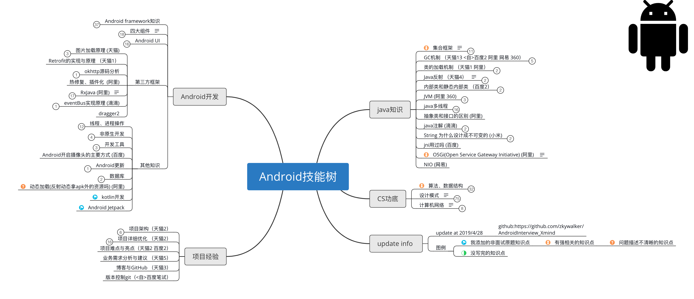

# Android SKILLS Mind Mapping

### 简介

- Android 技能树。很多知识点参考了网上一份大厂面试的长图，然后加上我自己开发经验、面试和收集的一些内容。
- 后面以此为基础更新了更多的Android开发必备知识。xmind版点击单条后面的备注有我总结的简略答案和可以参考的文章。
- 较为基础的知识点和api用法为了技能树的简介就不罗列了。



#### 下载

[xmind版本](./Android_interview_tree.xmind)

[图片版本](./android_interview_xmind_image.png)


#### 正确食用&&为什么用思维导图

- 埃隆马斯克： ```重要的是，要把知识看成是一种语义树：在你进入叶子/细节之前，要确保你理解基本原则，即树干和大树枝，否则它们就不值得去耗费时间```
- 网络上优质博客和文章很多了，这个脑图的目的不是做知识的搬运工，所以知识点非常简练
- 这个脑图不是让你按它套着去应付面试，而是按它去梳理和学习知识
- 将知识点拆分、归纳、理解、然后再反思、汇集知识、从知识反思案例，形成完善的知识网络
- 可以参考设计模式部分的思路：拆分理解原理->思考设计模式的要点->阅读和归纳Android系统里对应模式的代码->最后自己实践并回归知识的学习
- [参考：思维导图真的有效吗？YJango的回答](<https://www.zhihu.com/question/20273625>)

一些题外话:笔者经过一段时间的准备，BATM过了两家半的技术面试，不过都没发下来offer（B HC被砍，M HR嫌涨幅高，A心态蹦了最终面算法没过），吐槽下HR都是满嘴跑火车还一直拖着你，真是*。面试总结就是：1.别信HR的话，她骗你你也酌情骗她，正式offer没发都是浮云。2.好好准备下算法。

#### 参考资料

[《Android源码设计模式解析与实战》](<https://book.douban.com/subject/26644935/>)

[《深入理解Android》系列](https://book.douban.com/subject/11542973/)

[《Android开发艺术探索》](<https://book.douban.com/subject/26599538/>)

[网上的一份面试总结](./quote_interview.jpg)

[flutter知识脑图](./flutter-Learning.xmind)

## 更新日志

####  v0.1

- 第一版提交

####  V0.2   2019/04/28 

- 更新整体结构为Android知识在左侧，CS基础知识在右侧
- 更新设计模式部分结构
- 更新数据结构-树等知识点

#### V0.2.1   2019/05/17

- 添加flutter部分详细知识脑图
- 添加rxJava部分知识点
- 修改知识点结构
